# GaitSole HoloTile Simulation

**Regional foot-sole biomechanics, low-latency gait prediction, and an interactive HoloTile-style omnidirectional floor — from OpenSim through Python, MuJoCo, Gazebo, and Unity.**

Repository: [github.com/AashutoshKushwaha/GaitSole-Holotile-Simulation](https://github.com/AashutoshKushwaha/GaitSole-Holotile-Simulation)

This project supports **GaitSole** (per-region plantar GRF simulation + PyTorch motion predictor) and **HoloTile** (Disney patent US20180217662A1–style active floor for VR rehabilitation, bot training, and gait-aware locomotion research).

---

## Results gallery

### OpenSim — per-region foot loading

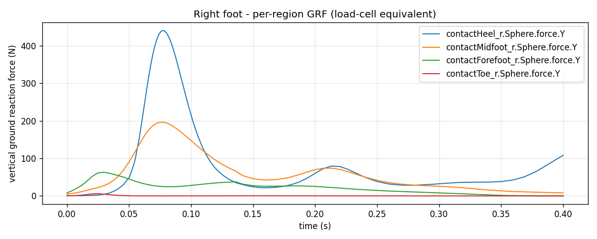

Eight independent plantar patches (heel / midfoot / forefoot / toe × left/right) replace a single whole-foot contact model.

### MuJoCo — HoloTile control research (`holotile_sim/`)

| Walk demo | Control frame | Fusion sweep |
|-----------|---------------|--------------|
| 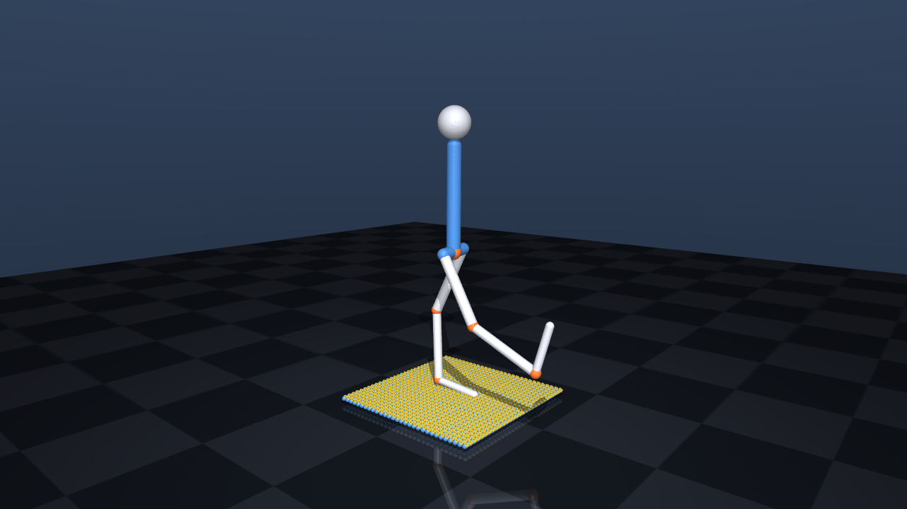 | 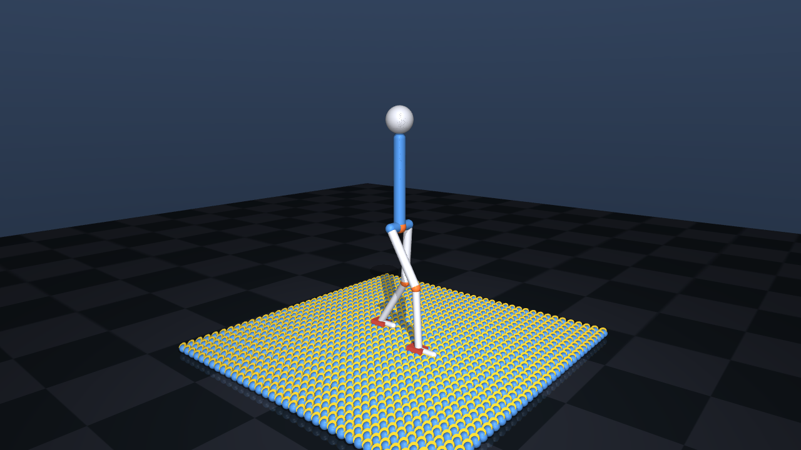 | 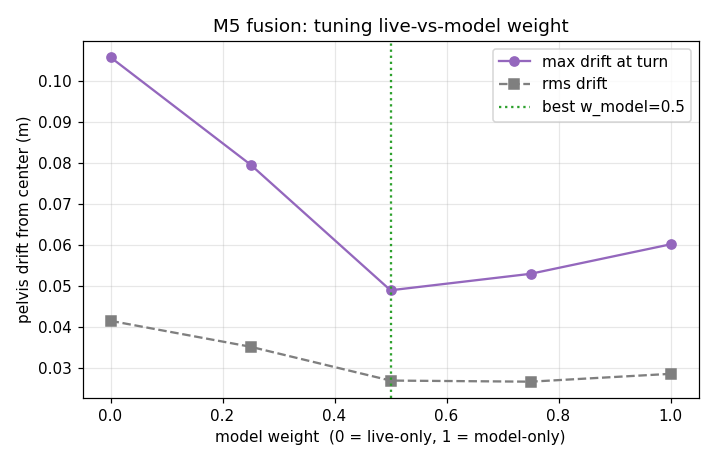 |

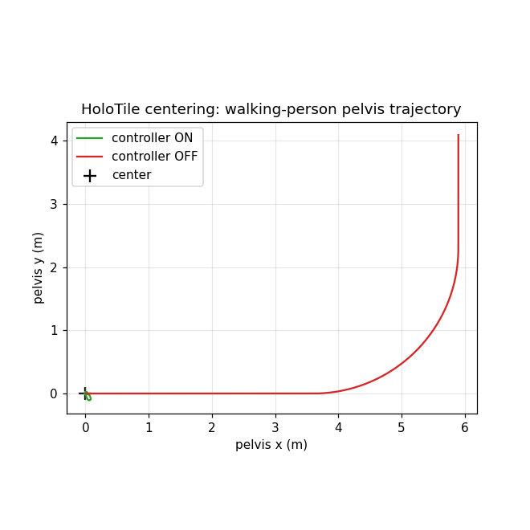

### Gazebo — predictor + perception loop (`gazebo_gait/`)

| Verification curves | Perception overlay | Reference pose |
|---------------------|-------------------|----------------|
| 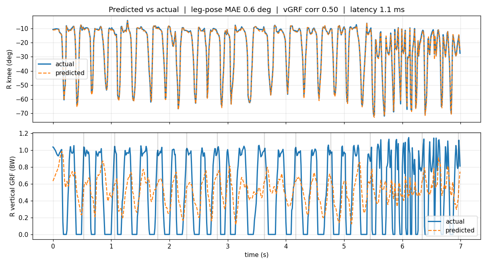 | 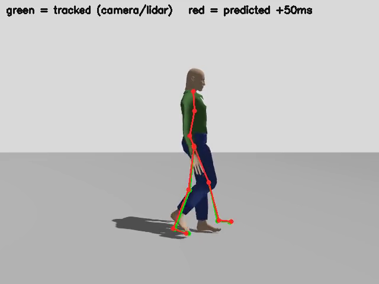 | 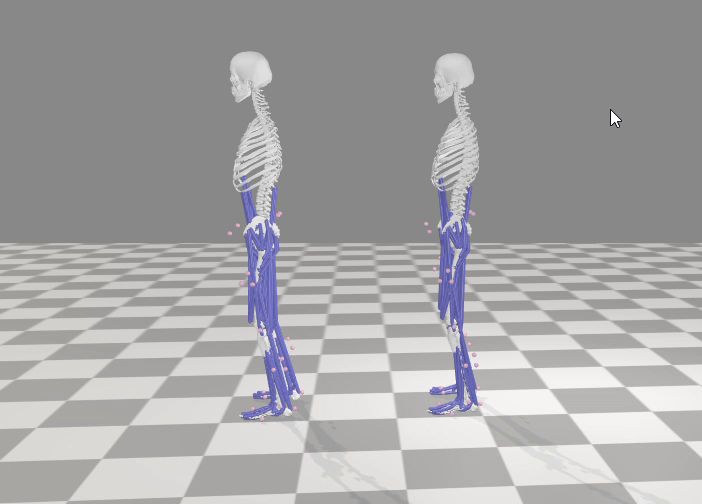 |

### Unity — human walker on HoloTile (`holotile_unity/`)

| Walker view | Additional frames |
|-------------|-------------------|
| 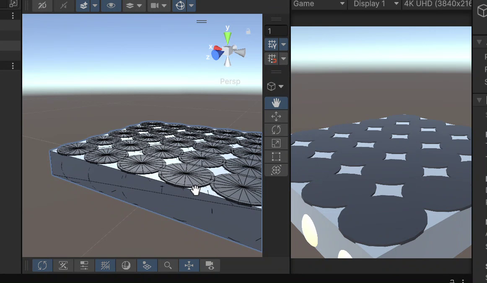 | 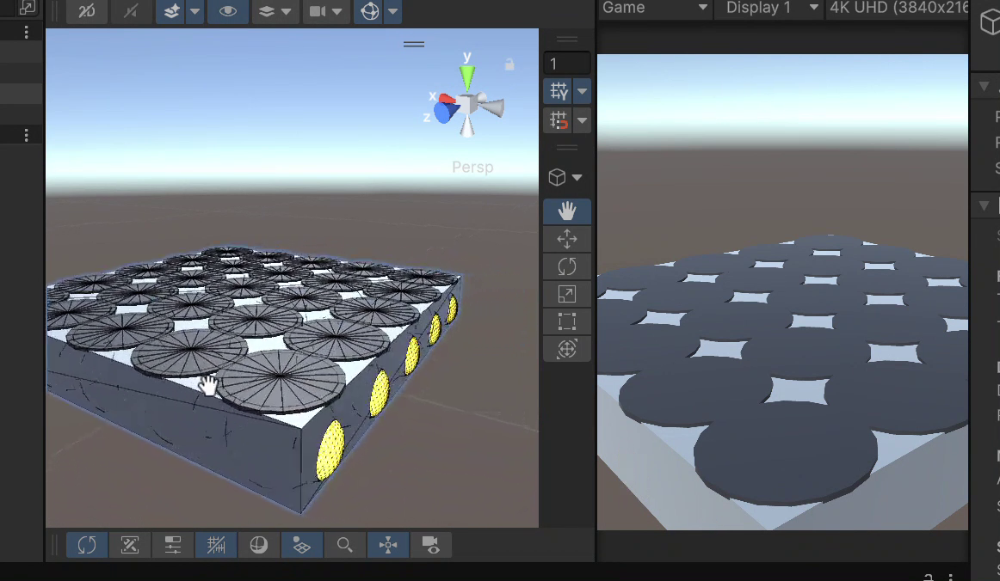 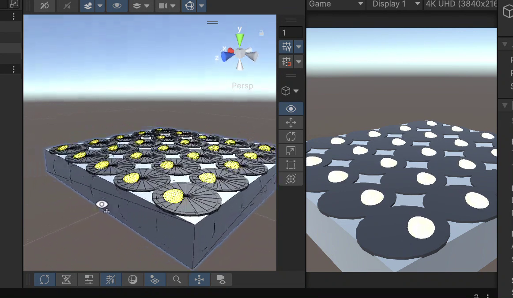 |

OpenSim `walk_motion.sto` + `walk_GRF.sto` drive a Mixamo character, 4-region GRF steers per-disc tile commands, pelvis stays centered. See [holotile_unity/README.md](holotile_unity/README.md) for setup.

---

## Pipeline at a glance

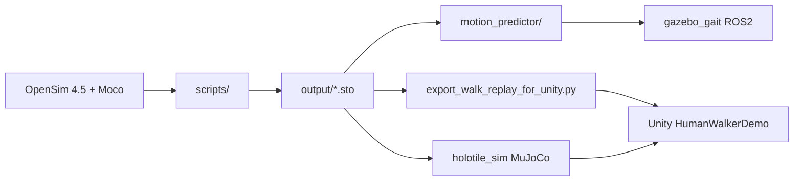

| Stage | Folder | Role |
|-------|--------|------|
| **1. Biomechanics** | `scripts/` | Build 4-region `.osim` models, run forward/Moco solves, extract per-region GRF |
| **2. ML predictor** | `motion_predictor/` | PyTorch legs-only predictor (~sub-ms inference on CPU) |
| **3. HoloTile physics** | `holotile_sim/` | MuJoCo reference: disk kinematics, floor controller, fusion |
| **4. Embodied testbed** | `gazebo_gait/` | Gazebo Harmonic + ROS 2 Jazzy: camera/lidar → angles → predictor → verify |
| **5. Interactive demo** | `holotile_unity/` | Unity 6 URP: visual character, GRF-driven tiles, belt physics, centering |

Full narrative: **[documentation.md](documentation.md)**

---

## Repository structure

```
GaitSole-Holotile-Simulation/
├── README.md                         # this file
├── documentation.md                  # end-to-end project documentation
├── docs/
│   ├── PUBLISHING.md                 # how to push (owner commits only)
│   ├── WORKSPACE_LAYOUT.md           # what is in git vs local/
│   ├── assets/                       # README screenshots
│   └── references/                   # US20180217662A1 patent PDF, papers
│
├── models/                           # committed .osim models
│   ├── 2D_gait_4regions.osim
│   ├── Rajagopal2016_4regions_fingers.osim
│   └── README.md
│
├── local/                            # GITIGNORED — recordings, zips, scratch (see docs/WORKSPACE_LAYOUT.md)
├── scripts/                          # OpenSim + Moco pipeline (run in order)
│   ├── 01_inspect_2d_gait.py
│   ├── 02_forward_sim_per_region_forces.py
│   ├── 03_upgrade_to_4_regions.py
│   ├── 04_read_force_sto.py
│   ├── 05_predictive_running_moco.py
│   ├── 06_extract_grf_from_solution.py
│   ├── 07_walk_driven_per_region_grf.py
│   ├── 08_tile_strides.py
│   ├── 09_build_rajagopal_arms_fingers.py
│   ├── 10_inspect_and_test_rajagopal.py
│   ├── 11_predictive_running_3d_moco.py
│   └── export_walk_replay_for_unity.py   # → holotile_unity/StreamingAssets/
│
├── motion_predictor/                 # PyTorch low-latency gait predictor
│   ├── config.py, data.py, model.py
│   ├── train.py, infer_stream.py
│   └── README.md
│
├── holotile_sim/                     # MuJoCo HoloTile reference implementation
│   ├── holotile_config.py, floor_controller.py, fusion.py
│   ├── sim_world.py, mjcf_builder.py
│   ├── run_demo.py, run_walk.py, run_control.py
│   └── output/                       # PNG frames (copies in docs/assets/)
│
├── gazebo_gait/                      # Gazebo + ROS 2 perception/predictor loop
│   ├── nodes/                        # perception, angle_solver, predictor, verify, gait_player
│   ├── worlds/, meshes/, scripts/
│   ├── gait_config.py, fk.py
│   └── README.md
│
├── holotile_unity/                   # Unity 6 (6000.3.11f1) URP interactive demo
│   ├── Assets/HoloTile/
│   │   ├── Scripts/
│   │   │   ├── Config/HolotileConfig.cs
│   │   │   ├── Demo/                 # MechanismDemo, WalkerDemo, HumanWalkerDemo
│   │   │   ├── OpenSim/              # replay, FK, GRF → tile commands, FBX driver
│   │   │   ├── Physics/              # RegionalFoot, RegionalBeltDrive, BeltDrive
│   │   │   ├── Mechanism/            # ActiveTile, DiskAssembly, FloorGrid
│   │   │   └── Control/              # FloorController, WalkerSim
│   │   ├── Editor/OpenSimExportMenu.cs
│   │   ├── Characters/               # optional Mixamo Walking.fbx
│   │   └── StreamingAssets/OpenSim/walk_replay.json
│   └── README.md
│
├── output/                           # OpenSim .sto outputs (gitignored; only .gitkeep tracked)
```

> **Note:** Older docs referred to `simulation_scripts/` — that folder is now **`scripts/`**.

---

## Quick start

### OpenSim pipeline (`scripts/`)

**Prerequisites:** OpenSim 4.5 with Moco, Python bindings (conda `opensim_env` recommended), `numpy`, `pandas`, `matplotlib`.

```bash
conda activate opensim_env
cd scripts

# 2D track
python 01_inspect_2d_gait.py
python 03_upgrade_to_4_regions.py
python 07_walk_driven_per_region_grf.py    # → output/walk_motion.sto, walk_GRF.sto

# Export for Unity
python export_walk_replay_for_unity.py
```

Edit path constants at the top of each script if your OpenSim install is not under `E:/OpenSim/4.5/`.

### Motion predictor (`motion_predictor/`)

```bash
cd motion_predictor
pip install -r requirements.txt
python train.py              # synthetic demo → runs/predictor.pt
python infer_stream.py       # streaming benchmark (~0.9 ms/step on laptop CPU)
```

### MuJoCo HoloTile (`holotile_sim/`)

```bash
cd holotile_sim
pip install mujoco numpy matplotlib
python run_demo.py           # disk kinematics demo
python run_walk.py           # walker on floor
python run_control.py        # controller + fusion
```

### Gazebo gait loop (`gazebo_gait/`)

Runs in **WSL Ubuntu 24.04**: Gazebo Harmonic, ROS 2 Jazzy, CPU PyTorch.

```bash
source /opt/ros/jazzy/setup.bash
~/venvs/gait/bin/python nodes/perception_node.py
# See gazebo_gait/README.md for full pipeline scripts
```

### Unity human walker (`holotile_unity/`)

1. Open `holotile_unity/` in Unity Hub (**6000.3.11f1**, URP).
2. Menu: **HoloTile → Export OpenSim Walk Replay** (or run Python export first).
3. Empty GameObject → add **`HumanWalkerDemo`** → Play.

**Recommended Inspector defaults:** `pingPongLoop = true`, `replayTimeScale = 0.65`, `useRegionalGrfCommands = true`, `centerPelvis = true`.

Optional Mixamo FBX on **Custom Character Prefab**; green foot pucks follow visible foot bones via `ImportedCharacterDriver.TryGetFootTargets()`.

Details: [holotile_unity/README.md](holotile_unity/README.md)

---

## OpenSim simulation pipeline

| Step | Script | What it does |
|------|--------|--------------|
| 1 | `01_inspect_2d_gait.py` | Inspect joints, contacts, muscles on stock 2D gait model |
| 2 | `02_forward_sim_per_region_forces.py` | Forward sim; read per-sphere contact forces |
| 3 | `03_upgrade_to_4_regions.py` | Build `2D_gait_4regions.osim` (heel/mid/fore/toe) |
| 4 | `04_read_force_sto.py` | Plot per-region vertical force from `.sto` |
| 5 | `05_predictive_running_moco.py` | 2D predictive running Moco solve (~10–30 min) |
| 6 | `06_extract_grf_from_solution.py` | Per-region GRF from saved solution |
| 7 | `07_walk_driven_per_region_grf.py` | Walking-driven per-region GRF (fast, reliable) |
| 8 | `08_tile_strides.py` | Tile half-stride into N full strides |
| 9 | `09_build_rajagopal_arms_fingers.py` | Build 3D `Rajagopal2016_4regions_fingers.osim` |
| 10 | `10_inspect_and_test_rajagopal.py` | Inspect + prescribed-motion preview |
| 11 | `11_predictive_running_3d_moco.py` | Full 3D predictive running solve (long) |
| — | `export_walk_replay_for_unity.py` | JSON replay for Unity streaming assets |

---

## Unity architecture (M6 human walker)

| Component | Purpose |
|-----------|---------|
| `HumanWalkerDemo` | Main entry: replay clock, floor, character, regional feet |
| `OpenSimReplayData` | Load JSON, interpolate, **ping-pong loop** (~0.47 s half-cycle) |
| `OpenSimWalkFK` | 2D sagittal FK; sole alignment to floor |
| `RegionForceMapper` | GRF patches → surface velocity commands |
| `RegionalTileCommands` | Per-tile disc commands from 8 regional patches |
| `RegionalFoot` | 4-region belt patches, stance hysteresis, spring guide |
| `ImportedCharacterDriver` | Mixamo FBX: PlayableGraph scrub, scale, foot targets |
| `ProceduralCharacterMesh` | Fallback clothed mannequin if no FBX |

Earlier demos: **`MechanismDemo`** (disk kinematics), **`WalkerDemo`** (two foot pucks + centering).

---

## Gazebo nodes (`gazebo_gait/nodes/`)

| Node | Role |
|------|------|
| `perception_node.py` | Ground-truth / noisy keypoints from sim sensors |
| `angle_solver_node.py` | Keypoints → 12 joint angles + root @ 100 Hz |
| `predictor_node.py` | Rolling window → next pose + foot kinetics |
| `verify_node.py` | Predicted vs actual step metrics + plots |
| `gait_player.py` | Articulated walk playback in Gazebo world |

See [gazebo_gait/README.md](gazebo_gait/README.md) for WSL stack and run scripts.

---

## MuJoCo modules (`holotile_sim/`)

| Module | Role |
|--------|------|
| `disk_overlay.py`, `mjcf_builder.py` | Tile + disk MJCF assembly |
| `floor_controller.py`, `intended_velocity.py` | Keep-centered disk commands |
| `fusion.py`, `predictor_bridge.py` | Anticipatory velocity fusion |
| `run_demo.py`, `run_walk.py`, `run_control.py` | Milestone demos |

Unity `DiskKinematics.cs` and `floor_controller.py` are kept in parity.

---

## Prerequisites summary

| Subsystem | Requirements |
|-----------|--------------|
| OpenSim | 4.5 + Moco, conda Python env |
| Predictor | Python 3.10+, PyTorch ≥ 2.0, NumPy |
| MuJoCo | `mujoco`, NumPy, Matplotlib |
| Gazebo | WSL Ubuntu 24.04, ROS 2 Jazzy, Gazebo Harmonic |
| Unity | **6000.3.11f1**, URP, Windows (project path flexible) |

---

## Roadmap

- Perfect sync: visible feet ↔ control feet ↔ tile actuation
- Unity replay from `run3d_solution.sto` (running phase)
- MuJoCo predictor/fusion ported into Unity floor controller
- Per-region force heads in `motion_predictor/` trained on OpenSim 4-region data
- Live mocap / IMU / vision feeding `infer_stream.py` and Gazebo perception

---

## Publishing this repo

**Commits and pushes are done by the repository owner only** — not by AI assistants. See **[docs/PUBLISHING.md](docs/PUBLISHING.md)** for init, `.gitignore`, commit commands, and how to keep AI tools off the GitHub contributor graph.

---

## License

No license file is included yet. OpenSim, Moco, Rajagopal2016, and Mixamo assets carry their own terms — review before redistributing derived models or characters.

---

## Further reading

- [documentation.md](documentation.md) — full OpenSim → Python → Gazebo → MuJoCo → Unity story
- [PROJECT_PROGRESSION.md](PROJECT_PROGRESSION.md) — detailed technical milestones (if present)
- [motion_predictor/README.md](motion_predictor/README.md) — predictor I/O and training
- [holotile_unity/README.md](holotile_unity/README.md) — Unity phases D, C, M4, M6
- [gazebo_gait/README.md](gazebo_gait/README.md) — ROS 2 + Gazebo pipeline
