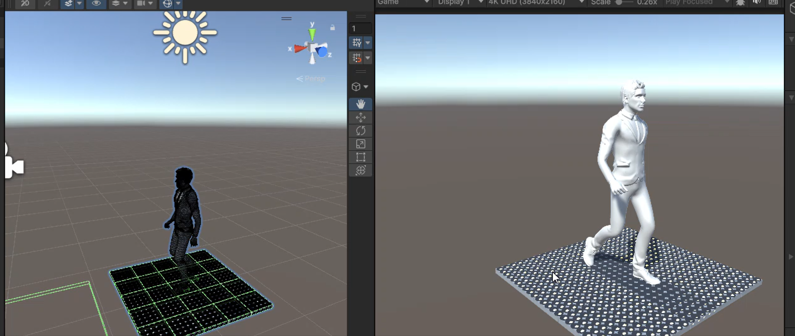

# HoloTile — Unity 6 (URP)

Unity implementation of Disney's HoloTile omnidirectional floor patent
**US20180217662A1**, ported from `holotile_sim/` (MuJoCo).

**Current phase: C — hybrid belt physics** (kinematics + test foot puck). Phase D remains available by disabling belt physics.

---

## Results (`Results/`)

Demo capture from **HumanWalkerDemo** (OpenSim walk replay + 4-region GRF on HoloTile floor):

<video src="https://github.com/AashutoshKushwaha/GaitSole-Holotile-Simulation/raw/main/holotile_unity/Results/result_v2.mp4" controls width="730">
</video>



| File | Description |
|------|-------------|
| `Results/result_v2.mp4` | Unity demo recording (no audio, Git LFS) |
| `Results/walking_unity.png` | Still frame for README / docs |

---

## What you will see when it works

### Phase D (default) — kinematics only

- A modular floor of **active tiles** (start with 1×1, scale to 8×8).
- Each tile contains a **5×5 array of disk assemblies** [FIG 11–12, FIG 19–22].
- **Scripted demo**: push direction slowly rotates (0.1 Hz); disks spin at 30 rad/s.
- **Gizmos** (Scene view): green = surface velocity arrow; orange = spin axis; yellow = rim point.

### Phase C — belt physics

- Enable **Enable Belt Physics** on `MechanismDemo`.
- Use **3×3 tiles or larger** so the test puck has room to translate.
- A **red shoe puck** drops onto frictionless tile pads; the **belt drive** pulls it toward each tile's commanded surface velocity.
- With **Scripted** drive (default), the puck follows a **curving path** as azimuth rotates — same behaviour as `holotile_sim/run_demo.py`.

### Phase M6 — OpenSim human walker (Replay) **← main demo**

1. **Export replay JSON** (either path):
   - Unity menu: **HoloTile → Export OpenSim Walk Replay**
   - Or from repo root: `python scripts/export_walk_replay_for_unity.py` (OpenSim conda env)
   - Output: `Assets/StreamingAssets/OpenSim/walk_replay.json` from `output/walk_motion.sto` + `walk_GRF.sto`
2. **Scene:** Empty GameObject → add **`HumanWalkerDemo`** (not `WalkerDemo` or `MechanismDemo`)
3. **Press Play**

**What you see:**
- Procedural clothed character (green/blue) **or** imported Mixamo FBX on **Custom Character Prefab**
- **Ping-pong loop** — export is ~0.47 s half-cycle; forward+reverse closes gait without a pop
- **4-region GRF** (heel/mid/fore/toe per foot) steers per-disc tile commands via `RegionalTileCommands`
- Pelvis stays centered (`centerPelvis`); green foot pucks follow **visible foot bones** when FBX is used
- Default camera: position `(2.05, 1.54, -2.02)`, rotation `(15, -50, 0)` (`HolotileConfig`)

**Recommended Inspector defaults on `HumanWalkerDemo`:**

| Field | Value | Notes |
|-------|-------|-------|
| Ping Pong Loop | ✓ | Smooth continuous walk |
| Replay Time Scale | `0.65` | Matches visible gait speed |
| Use Regional Grf Commands | ✓ | Per-patch belt drive |
| Center Pelvis | ✓ | HoloTile keep-centered |
| Physics Coupled | ✓ | Kinematic feet when FBX driver active |

**Optional Mixamo character:**
1. Download FBX from [Mixamo](https://www.mixamo.com) → `Assets/HoloTile/Characters/` (e.g. `Walking.fbx`)
2. FBX → **Rig → Humanoid** → Apply
3. Assign to **Custom Character Prefab** on `HumanWalkerDemo`
4. **HoloTile → Validate Character FBX**

`ImportedCharacterDriver` scales to ~1.7 m, aligns **soles** to floor support height, scrubs walk clip via **PlayableGraph** (Humanoid-safe). Adjust **Facing Yaw Deg** (`0`, `90`, `-90`) if the character faces the wrong way.

**Disc / gait tuning:** Walk Speed, Spin Max, Controller Kp (same family as `WalkerDemo`).

**Performance:** 6 physics substeps target **60 FPS @ 1080p** on laptop GPUs.

Root project docs: [../README.md](../README.md), [../documentation.md](../documentation.md).

### Phase M4 — walker centering (foot pucks)

- Add **`WalkerDemo`** (not `MechanismDemo`) to an empty GameObject.
- Defaults: **7×7 floor**, **controller ON**, two foot pucks, scripted walk **+X then turn +Z**.
- **Disc / gait tuning** (Inspector sliders, live in Play mode):
  - **Walk Speed** — how fast the person tries to walk (m/s)
  - **Spin Max Rad Per Sec** — cap on disk spin ω (surface speed ≈ ω × 0.0158 m/s)
  - **Controller Kp** — keep-centered aggressiveness
- **Blue gizmo sphere** = pelvis; **+** at origin = floor centre.
- Toggle **Controller Enabled** off → person **walks off the floor** (compare demo).
- Console logs pelvis drift each second; max drift should stay small when controller is ON.

---

## Prerequisites

| Item | Value |
|------|--------|
| Unity | **6000.3.11f1** (you have this) |
| Render pipeline | **URP** |
| OS | Windows (project path `E:\OpenSim\holotile_unity`) |

---

## First-time Unity setup (you have NOT opened this project yet)

### Option A — Open this folder directly (recommended)

1. Open **Unity Hub**.
2. Click **Add** → **Add project from disk**.
3. Select: `E:\OpenSim\holotile_unity`
4. Unity Hub may show a warning that the project is incomplete — that is normal.
5. Click the project to open it with editor **6000.3.11f1**.
6. First open will take a few minutes: Unity generates missing `ProjectSettings`, imports URP package, compiles scripts.
7. If prompted **Enter Safe Mode** due to errors, click **Exit Safe Mode** after compile finishes.

### Option B — Fresh URP template, then point at scripts

If Option A gives pipeline errors:

1. Unity Hub → **New project** → **3D (URP)** → name `HoloTile` → create.
2. Close Unity. Copy `Assets/HoloTile/` from this repo into the new project's `Assets/`.
3. Copy `Packages/manifest.json` dependencies for URP if needed.

### After first open — fix render pipeline (if pink materials)

1. **Edit → Project Settings → Graphics**
2. Set **Scriptable Render Pipeline Settings** to a URP asset.
3. If none exists: **Assets → Create → Rendering → URP Asset (with Forward Renderer)**.
4. Assign it in Graphics settings.

---

## Scene setup (5 minutes)

1. **File → New Scene** (or use default `SampleScene`).
2. Save as `Assets/HoloTile/Scenes/HolotileMechanism.unity`.
3. **GameObject → Create Empty** → rename to `HoloTileRoot`.
4. **Add Component** → search `MechanismDemo` → add it.
5. Inspector settings (defaults are fine):

   | Field | Recommended first run |
   |-------|----------------------|
   | Tiles X / Y | `1` (kinematics) or `3` (belt physics) |
   | Drive Mode | `Scripted` |
   | Run On Play | ✓ checked |
   | Enable Belt Physics | off (Phase D) or on (Phase C) |
   | Spawn Test Puck | ✓ when belt physics on |
   | Show Debug Gizmos | ✓ checked |

6. Ensure scene has a **Main Camera** and a **Directional Light** (default scene has both).
7. Press **Play**.

### Verify (Phase D)

- Console log: `Built 1x1 floor (Phase D (kinematics))...`
- Grey plate with recessed hemispheres and yellow rim markers orbiting.
- Push direction (green gizmo arrow in Scene view) rotates slowly.

### Verify (Phase C)

- Set **Tiles X / Y** to `3`, enable **Enable Belt Physics**, press Play.
- Console log: `Built 3x3 floor (Phase C (belt physics))...`
- Red puck settles on the plate, then **slides in a curving path** as azimuth sweeps.
- Set **Spin Rad Per Sec** to `0` — puck stops translating (only azimuth changes).

### Manual drive

Switch **Drive Mode** to `Manual`, set **Azimuth Deg** 0→90→180 and confirm push direction changes.
Set **Spin Rad Per Sec** to `0` — disks stop; rim markers freeze.

### Scale up

Set **Tiles X** and **Tiles Y** to `8` → full 8×8 modular floor (64 tiles × 25 disks = 1600 disk assemblies).

---

## Script architecture (patent part → script)

```
Config/
  HolotileConfig.cs          Patent constants (tile size, tilt, R, DRAG_PER_OMEGA)

Math/
  DiskKinematics.cs          Pure physics/math functions (no Unity objects)
  TileCommand.cs             (alpha, omega) command struct

Mechanism/
  SwashplateDrive.cs         [FIG 11] Azimuth orienting mechanism
  SpinDrive.cs               [FIG 11] Disk rotation about tilted axis
  ContactDiskVisual.cs       [FIG 11] Raised rim contact point visual
  DiskAssembly.cs            Full hierarchy: mount → swashplate → spin → disk
  StructuralPad.cs           [FIG 3]  Tile support surface (visual only in Phase D)
  ActiveTile.cs                [FIG 3]  N×N disk array + shared command
  FloorGrid.cs                 [§0046]  Modular floor grid

Demo/
  MechanismDemo.cs           Phase D/C entry point
  WalkerDemo.cs              Phase M4 walker centering
  HumanWalkerDemo.cs         Phase M6 OpenSim replay + character
  MechanismDebugDraw.cs      Scene gizmos

OpenSim/  (M6)
  OpenSimReplayData.cs       JSON loader, ping-pong loop, interpolation
  OpenSimWalkFK.cs           2D sagittal FK, sole alignment
  RegionForceMapper.cs       GRF → surface velocity
  RegionalTileCommands.cs    Per-tile disc commands from 8 patches
  ImportedCharacterDriver.cs Mixamo FBX + PlayableGraph scrub
  ProceduralCharacterMesh.cs Fallback mannequin

Control/  (M4)
  FloorController.cs         Keep-centered disk commands
  IntendedVelocity.cs        Scripted v_cmd(t) path
  WalkerSim.cs               Two-foot stance/swing gait

Physics/  (Phase C + M6)
  BeltDrive.cs               Analytic moving-surface friction
  FootPuck.cs                Test foot rigidbody (frictionless contact)
  RegionalFoot.cs            4-region patches, stance hysteresis
  RegionalBeltDrive.cs       Per-patch belt drive
  FloorPhysicsController.cs  FixedUpdate belt drive loop
  HolotilePhysicsMaterials.cs

Editor/
  OpenSimExportMenu.cs       Menu: Export OpenSim Walk Replay
```

---

## Key physics functions (defined in `DiskKinematics.cs`)

| Function | Patent meaning |
|----------|----------------|
| `SpinAxisWorld(α)` | Tilted rotation axis after swashplate azimuth |
| `RimOffsetWorld(α)` | Vector to raised rim contact point |
| `SurfaceVelocity(α, ω)` | Horizontal speed imparted at contact: `ω·R·sin(θ)·(sin α, −cos α)` on XZ |
| `CommandFromVelocity(v)` | Inverse: desired velocity → (α, ω) — used in Phase C controller |

**Parity target:** `holotile_sim/floor_controller.py` and `sim_world.surface_velocity()`.

---

## Roadmap

| Phase | Content | Status |
|-------|---------|--------|
| **D** | Mechanism kinematics | ✅ |
| **C** | Hybrid physics: frictionless pad + `BeltDrive` + test puck | ✅ |
| **M4** | Walker centering controller (two-foot gait + keep-centered) | ✅ `WalkerDemo` |
| **M6** | OpenSim walk replay, 4-region GRF, human character, regional feet | ✅ `HumanWalkerDemo` |
| **M5** | Predictor + sensor fusion in Unity | later |

---

## Relation to repo

- [../README.md](../README.md) — full monorepo overview and results gallery
- [../scripts/export_walk_replay_for_unity.py](../scripts/export_walk_replay_for_unity.py) — OpenSim → JSON export
- `holotile_sim/` — MuJoCo reference (numbers must match `DiskKinematics.cs`)
- `gazebo_gait/` — Gazebo + ROS 2 predictor/perception testbed
- `motion_predictor/` — anticipatory velocity (future Unity floor control)
- `US20180217662A1.pdf` — patent source (if present at repo root)
